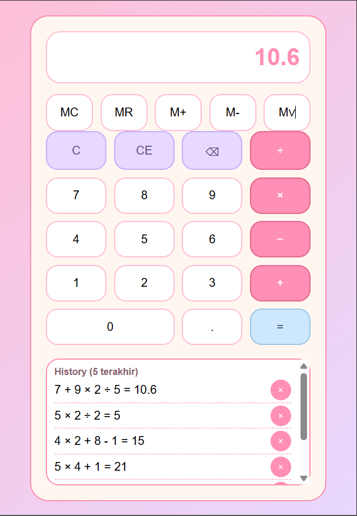
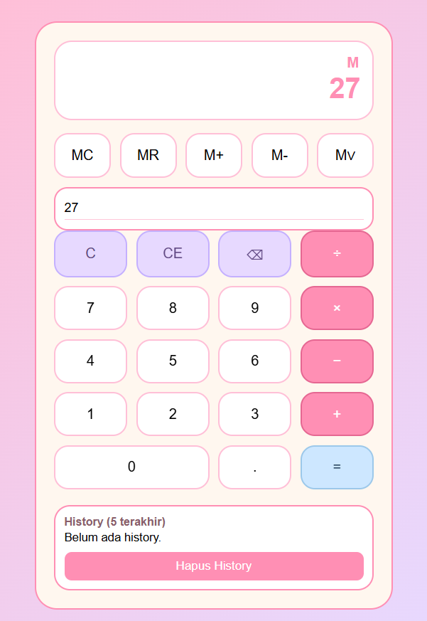

1. Perhitungan Berantai

Dapat melakukan beberapa operasi aritmatika secara berurutan. Contoh perhitungan:

7 + 9 × 2 ÷ 5 = 10.6

Hasil tersebut benar karena program menghitung ekspresi berdasarkan aturan prioritas operator, yaitu:

Perkalian dan pembagian dihitung terlebih dahulu.

Penjumlahan dan pengurangan dilakukan setelahnya.

Perhitungan dilakukan melalui fungsi calculateExpression()

2. History (5 Terakhir)

Setiap kali tombol "=" ditekan, hasil perhitungan akan disimpan ke dalam daftar history. Contoh data history yang tampil:

7 + 9 × 2 ÷ 5 = 10.6

5 × 2 ÷ 2 = 5

4 × 2 + 8 - 1 = 15

5 × 4 + 1 = 21

Fitur history memiliki beberapa karakteristik:

- Menampilkan hasil dari yang terbaru.

- Menyimpan maksimal lima riwayat perhitungan.

- Pengguna dapat menghapus satu riwayat dengan tombol “x”.

- Pengguna dapat menghapus seluruh riwayat dengan tombol “Hapus History”.

3. Indikator Memory

Huruf "M" yang muncul di bagian kanan atas display menunjukkan bahwa terdapat nilai yang tersimpan di memory. Indikator ini aktif ketika pengguna melakukan penyimpanan menggunakan M+ atau M-.

4. Nilai Memory Ditampilkan

Nilai memory dapat ditambahkan menggunakan M+ dan dikurangi dengan M-.
Ketika pengguna menekan MR (Memory Recall), nilai memory akan ditampilkan pada display utama.

5. History Kosong

Jika pengguna hanya menggunakan memory tanpa menekan tombol “=”, maka history akan tetap menampilkan pesan:

Belum ada history.

